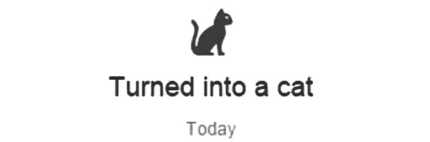

  

  
<table>
<tr>
<td width="35%" align="center">

</td>
<td width="65%">

  

Computer Science student at **Thapar Institute of Engineering & Technology** (CGPA: 8.3).

 

Building and experimenting with AI-powered applications while exploring **Machine Learning**, **Conversational AI**, **NLP**, **Speech Technologies**, **Generative AI**, and **Multimodal Systems**.

 

Driven by curiosity, research, and the challenge of turning complex ideas into products people can actually use.

 

🏆 **3rd Place — Israel–India Hackathon**

</td>
</tr>
</table>

## Highlights

**3rd Place — Israel–India Hackathon**

Built an AI-powered healthcare assistant for REUTH Rehabilitation Hospital. The system combined conversational AI with sentiment analysis to route patient interactions and trigger automated escalation workflows when distress signals were detected.

 

 

 

  
  
  
  

  
  
  

 

 

