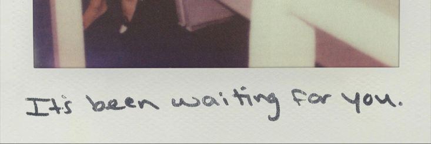

  

<table>
<tr>
<td width="35%" align="center">

</td>
<td width="65%">

  

Computer Science student at **Thapar Institute of Engineering & Technology** (CGPA: 8.3).

 

Building and experimenting with AI-powered applications while exploring **Machine Learning**, **Conversational AI**, **NLP**, **Speech Technologies**, **Generative AI**, and **Multimodal Systems**.

 

Driven by curiosity, research, and the challenge of turning complex ideas into products people can actually use.

 

🏆 **3rd Place — Israel–India Hackathon**

</td>
</tr>
</table>

## What I'm Building

<table>
<tr>
<td width="65%" valign="top">

### 📚 Anthology
> Research Intelligence Platform for scientific literature.
>
> • Hybrid Retrieval (Dense + Sparse Search)
> • Research Question Answering
> • Citation-Grounded Responses
> • FastAPI · PostgreSQL · pgvector
>
> 🔗 [Repository](https://github.com/Rupinder51120/Anthology)

 

### 🔬 PaperLens
> Multimodal Platform for Scientific Document Understanding.
>
> • Vision-Language Models
> • Figure & Table Understanding
> • Multimodal Retrieval
> • Research Analytics

 

### 🍀 CLOVER
> Full-Stack Flutter Application.
>
> • Mobile-First Design
> • Clean Architecture
> • Modern UI/UX
>
> 🔗 [Repository](https://github.com/Rupinder51120/CLOVER)

 

### 🎵 Music Genre Classification
> Audio Machine Learning Project.
>
> • Feature Extraction
> • Genre Prediction
> • Audio Signal Processing
>
> 🔗 [Repository](https://github.com/Rupinder51120/Music_Genre_Classification)

 

### 👤 Face Detection System
> Computer Vision Project.
>
> • Face Detection Pipeline
> • OpenCV & Deep Learning Methods
>
> 🔗 [Repository](https://github.com/Rupinder51120/Face-detection)

</td>
<td width="35%" align="center" valign="top">

  

**Currently Exploring**

Conversational AI · Multimodal AI · Generative AI · Retrieval Systems

</td>
</tr>
</table>

## 🏆 Highlight

**3rd Place — Israel–India Hackathon**

Built an AI-powered healthcare assistant for REUTH Rehabilitation Hospital. The system combined conversational AI with sentiment analysis to route patient interactions and trigger automated escalation workflows when distress signals were detected.

## Tech Stack

**Languages**

**Frontend & Backend**

**AI / ML & Tools**

*Also working with: LangChain · HuggingFace Transformers · pgvector · RAG Pipelines · Computer Vision · OpenCV*

## GitHub Stats

## Activity

 

 

 

 

**Open to AI/ML Internships · Software Engineering Internships · Research Engineering Roles**

*Mansa, Punjab, India · rkaur3_be23@thapar.edu*

